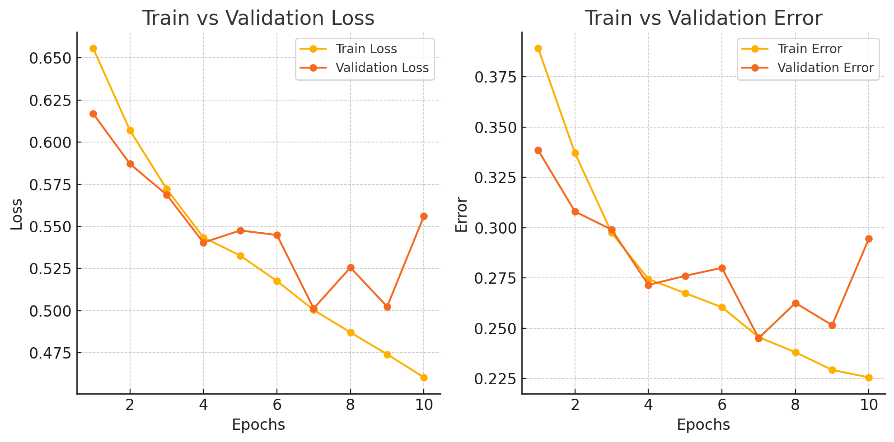
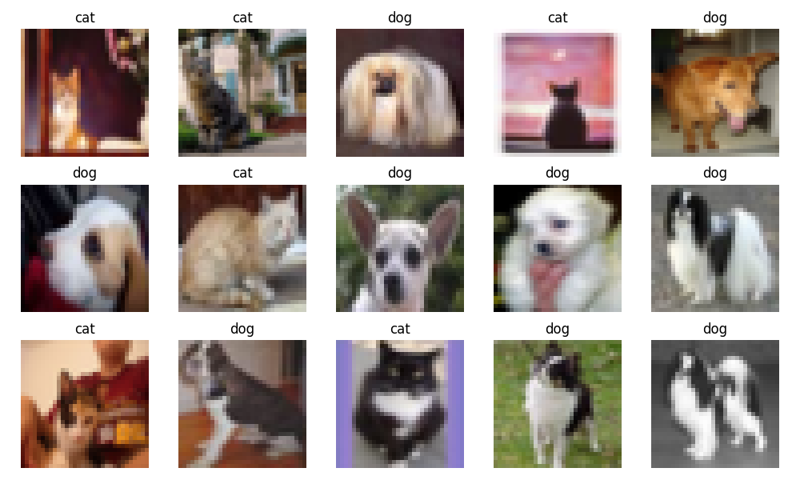

# Cats vs Dogs Classifier

This project involves training a **Convolutional Neural Network (CNN)** to classify images of **cats** and **dogs**. We are using a subset of the **CIFAR-10 dataset**, which consists of color images of size 32x32 pixels belonging to 10 categories. In this project, we will focus on the **cat** and **dog** categories, and the model is trained to differentiate between the two.

The CIFAR-10 dataset is publicly available and can be accessed [here](https://www.cs.toronto.edu/~kriz/cifar.html). The dataset is automatically downloaded the first time the training script is run.

---

## Dataset

We make use of the **CIFAR-10 dataset**, which consists of 60,000 32x32 color images categorized into 10 classes. For this project, we focus only on the **cat** and **dog** categories. The images are split into three sets:

- **Training set**: Used to train the model.
- **Validation set**: Used to tune hyperparameters and avoid overfitting.
- **Test set**: Used to evaluate the model's final performance.

The dataset is automatically downloaded the first time the `main.py` script is executed.

---

## Project Structure

- **`data_loader.py`**: Handles data loading, preprocessing, and splitting the dataset into training, validation, and test sets.
- **`model.py`**: Defines the architecture of the CNN model.
- **`train.py`**: Contains the training loop and functions for optimizing the model.
- **`evaluate.py`**: Defines functions for evaluating model performance on the validation and test sets.
- **`plot.py`**: Provides utility functions for visualizing training results.

---

## Training Results

The model was trained for **10 epochs**, with the following results:

- **Test Error**: 0.4505
- **Test Loss**: 0.5618

### Learning Curves

The learning curves for both **training** and **validation** error and loss are shown below. These curves illustrate how the model's performance improved during training.

---

## Sample Images

Below is a sample image from the dataset, representing one of the **cat** or **dog** categories:

---

## Conclusion

The model successfully learned to classify images of cats and dogs with a test error of **45.05%** and a test loss of **0.5618**. While the model performs well, there is room for improvement in validation performance, indicating that further hyperparameter tuning and techniques such as data augmentation or regularization could help reduce overfitting.

### Next Steps

- **Model Improvement**: Experiment with more complex architectures (e.g., ResNet, VGG) or fine-tuning pre-trained models.
- **Data Augmentation**: Apply data augmentation strategies to further improve the model's robustness.
- **Hyperparameter Tuning**: Optimize hyperparameters like the learning rate, batch size, and number of epochs to improve the model's generalization to the validation and test sets.

---

## Licensing

This project is licensed under the MIT License - see the [LICENSE](LICENSE) file for details.

---

Let me know if you'd like to make any adjustments or if there's anything else you'd like to include!
